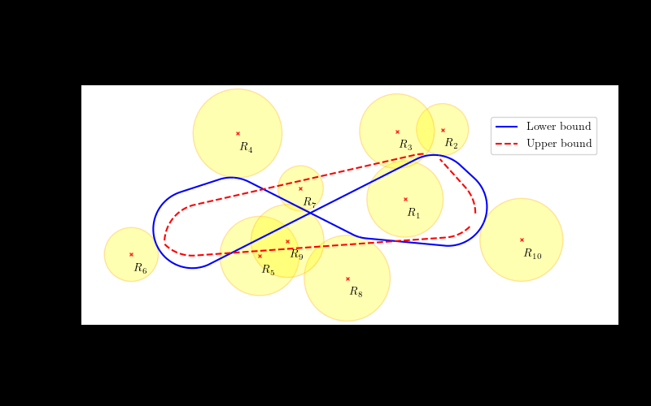

# OptimalDTSPN

This repository provides a BnB solver for finding near-optimum solutions for the Dubins Traveling Salesman Problem with Neighborhoods (DTSPN). The problem stands to find the minimum length curvature-constrained tour (closed-loop path) connecting a given set of target regions such that the tour satisfies motion constraints of the Dubins vehicle with the limited turning radius $\rho$. In addition to near-optimum solutions, the BnB solver also provides tight lower bounds, and thus it may serve as a benchmark method for any future approaches to the DTSPN.



```
@article{vana2022dtspn,
  title={On the Optimal Solution of the Dubins Traveling Salesman Problem with Neighborhoods},
  author={Petr V{\'a}{\v{n}}a, Jindri{\v{s}}ka Deckerov{\'a}, Jan Faigl},
  journal={IEEE Transactions on Robotics},
  year={2022},
  note={(In review)}
}
```

## DTSPN solver 

The proposed DTSPN solver is provided in the directory `OptimalDTSPN.jl` and is implemented in [Julia language](https://julialang.org/). Please see the `example.jl` where you can easily select the basic setting by changing the following lines.

``` julia
# Settings
turning_radius = 1.0    # ρ in the paper
branching_factor = 1.0  # α in the paper
filename = "instances/Behdani/dtspn-20-02-100-0.txt"
max_time = 60           # Timelimit in seconds
```

## DTSPN instances

The dataset in this repository contains 600 DTSPN instances from [1], for which both the results and tight lower bounds are computed and provided. The instances contains $n \in \{6, 8, 10, 12, 14, 16, 18, 20, 25, 30\}$ target regions. Besides the original instances with **Uniform** target radius, a new set of instances referred to as **Variable** is introduced to increase the diversity of the benchmark instances.
Here, the radius $\delta_i$ of the target region is randomly selected from the interval $\delta_i \in [0.5\delta, 1.5\delta]$, where $\delta$ is the original radius.
### Naming convention

For example `dtspn-30-01-025-1.txt` is the first instance that contains $n = 30$ regions. The radius of the regions is $\delta = 0.25$ and the redii is uniform.

### Encoding

Each row represents a single region with triplet (`x`, `y`, `radius`).

``` julia
4.86392 0.149846 0.29593093077120747
1.46245 3.64452 0.13471557913595383
2.35701 1.65899 0.17186260616727272
15.8164 4.45692 0.23719234446382642
1.90533 0.0466933 0.15282402311049506
0.142582 3.7788 0.37301715663987733
```

## Computed results

For each DTSPN instance, we have computed both a feasible solution and a tight lower bound. The time limit is set to 1 hour, and results are computed using Intel Xeon Scalable Gold 6146 CPU running at 3.2 GHz.

For each instance, we provide 5 files in `results` directory:
* `data.csv` - CSV capturing the evolution of LB and UB in the time
* `lb-dubins-paths.csv`- lower bound path
* `lb-sequence.txt` - sequence of visited targets via lower bound path
* `ub-dubins-paths.csv`- upper bound path
* `ub-sequence.txt` - sequence of visited targets via upper bound path

### Format of `data.csv` file

The main result file contains the following columns:
* `TIME` - computational time
* `LB` - lower bound value
* `UB` - upper bound value
* `OPEN` - size of the open list (priority queue)
* `GAP` - gap between the lower and upper bound
* `TREE` - total number in the search tree (`OPEN` < `TREE`)

```julia
TIME,LB,UB,OPEN,GAP,TREE
0.06925702095031738,0.0,55.62501135398224,1,100.0,1
0.06929397583007812,33.03188308301957,55.62501135398224,1,40.616851522395606,1
```

### Format of the paths (`xx-dubins-paths.csv`)

Both lower and upper bound solutions consist of multiple Dubins paths, which is represented by a single line containing two configurations and the length. The number of segments is the same as the corresponding sequence length stored in the `xx-sequence.txt` file.

The main result file contains the following columns:
* (`x1, y1, theta1`) - initial configuration of the Dubins path
* (`x2, y2, theta2`) - final configuration of the Dubins path
* `length` - length of the Dubins path

``` julia
x1,y1,theta1,x2,y2,theta,length
10.749383597884632,8.70807946622572,3.9269908169872414,8.33816979270864,6.414920533774278,3.1415926535897922,3.366307940393608
```

format of results

 * [MarkDown format](summary/OptimalDTSPN.md)
 * [CSV format](summary/OptimalDTSPN.csv)
 * [HTML format](summary/OptimalDTSPN.html)


### Thanks
The presented work has been supported by the Czech Science Foundation (GAČR) under research project No. 19-20238S.
   The support of the Ministry of Education Youth and Sports (MEYS) of the Czech Republic under project No. LTAIZ19013 is also acknowledged.
The access to the computational infrastructure of the OP VVV funded project CZ.02.1.01/0.0/0.0/16\_019/0000765 "Research Center for Informatics" is also gratefully acknowledged.

## Literature

[1] Behdani, Behnam, and J. Cole Smith. "An integer-programming-based approach to the close-enough traveling salesman problem." INFORMS Journal on Computing 26.3 (2014): 415-432.
